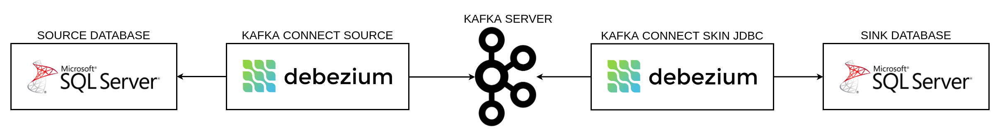
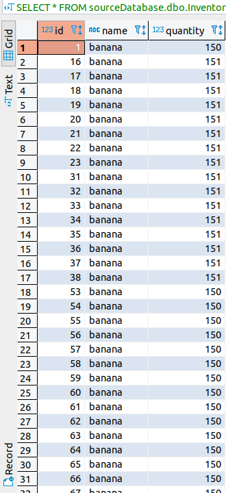
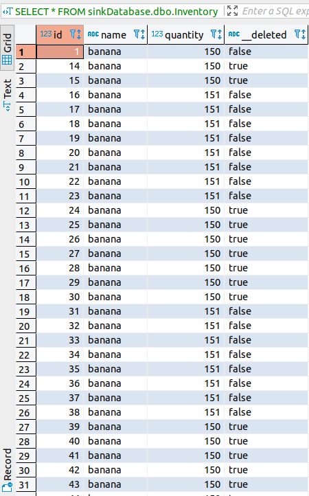

# CDC para SQL Server com Apache Kafka e Docker

## Overview

* ## Kafka

O Kafka é usado para criar pipelines de dados em tempo real e aplicativos de streaming. É escalável horizontalmente, tolerante a falhas, extremamente rápido e é executado em produção em milhares de empresas.

* ## Debezium

É um projeto de código aberto, que oferece vários plugins para buscar os dados de um banco de dados. Ele captura alterações em seus bancos de dados para que seus aplicativos possam ver e responder a essas alterações. O Debezium em uma transação registra todas as alterações em cada tabela do banco de dados.

* ## Kafka Connect

O Kafka Connect é uma ferramenta para transmitir dados de forma escalável e confiável entre o Apache Kafka e outros sistemas de dados. Torna simples a definição rápida de conectores que movem grandes conjuntos de dados para dentro e para fora do Kafka. O Kafka Connect pode ingerir bancos de dados inteiros ou coletar métricas de todos os servidores de aplicativos para os tópicos do Kafka, disponibilizando os dados para o processamento de fluxo com baixa latência. Um conector de exportação pode entregar dados de tópicos Kafka em índices secundários, como Elasticsearch ou sistemas em lote, como o Hadoop, para análise offline.

# Arquitetura



# Configurando o CDC para o seu RDS SQL Server

Para realizarmos a operação da captura de dados para o SQL Server. Primeiro temos que ativar esse recurso em nossa tabela do banco de dados. Para o banco de dados do RDS, podemos usar os seguintes comandos:

[Configurando CDC para RDS SQL Server](https://docs.aws.amazon.com/pt_br/AmazonRDS/latest/UserGuide/Appendix.SQLServer.CommonDBATasks.CDC.html)

```

USE __DATABASE_SOURCE__
EXEC msdb.dbo.rds_cdc_enable_db '__DATABASE_SOURCE__'
EXEC sys.sp_cdc_enable_table @source_schema = N'dbo', @source_name = N'__TABLE__', @role_name = NULL, @supports_net_changes = 1
EXEC sys.sp_cdc_change_job @job_type = 'capture', @pollinginterval = 300
GO

```

# Configurando imagem docker para a realização do sink com JDBC

Para a replicação dos dados vamos utilziar um plugin de conexão JDBC (Java Database Connectivity) sink. Dessa forma, vamos criar um `Dockerfile` baseado na imagem do Debezium e adicionar esse plugin. Vamos adicionar o driver de conexão do SQL Server também.

Dessa forma baixe e estraia o JDBC plugin no diretorio do `Dockerfile`
Baixe e estraia o drive do SQL Server também

```
FROM debezium/connect:1.0

COPY confluentinc-kafka-connect-jdbc-5.4.1/lib/*  /kafka/connect/kafka-connect-jdbc/
COPY confluentinc-kafka-connect-jdbc-5.4.1/etc/* /etc/

COPY mssql-jdbc-8.2.0.jre11.jar /kafka/connect/kafka-connect-jdbc/

```

* ## Observarções para aplicação de melhores práticas

Para o desenvolvimento das blue prints, será necessário o armazenamento das libs do kafka connect jdbc e driver de conexao do jdbc para sql server em um bucket s3 ou similiar. Assim, conseguiremos ter nosso repositório de dependencias bem estabelecido e controlado. Vamos, dessa forma, alterar o `Dockerfile` para que realize o download dessas libs no momento de build, evitando a realização das operações de `COPY` para o mesmo

* ## Porque não utilizamos a imagem confluentinc/cp-kafka-connect

Para esse cenário de extração e replicação para sql server, tivemos muitas dificuldades no setup dessa imagem. Ademais, com o setup dessa imagem não conseguimos realizar a operação de deleção, o erro era ocaicionado no momento de transforção dos dados para a realização do sink. Utilizamos os seguintes transformadores: `Flatten e ValueToKey`, ambos apresentaram erros na operação de deleção.

Dessa forma, procurarmos alternativas para a utilização do transformador nativo do Debezium, então definimos como transformador o `unwrap` utilizando a classe `io.debezium.transforms.ExtractNewRecordState`.

Portanto, precisavamos da aplicação core do debezium rodando, então, entendemos que a melhor saída seria utilizar a imagem base do Debezium e configurar o plugin do jdbc sink juntamente com o driver de conexão jdbc do sql server.

Porém, o método e deleção que conseguimos foi o de rewrite. Esse método irá criar uma coluna (`__deleted`) de controle da linha. Quando é feito uma inserção no banco de dados de origem é atribuido o valor `false` a essa coluna no banco de dados de destino, quando a linha é removida no banco de origem é atribuido `true` a essa coluna no banco de dados de destino.

Existe um método de deleção chamado `drop`. Caso a linha fosse removida no banco de dados ed origem, ela deveria excluir a mesma linha no banco de dados de destino. Porém nos nossos experiementos não houve esse comportamento, proém não foi aprsentando nenhum erro o que inviabilizou qualquer análise para a correção do mesmo.

É possível visualizar o resultado no final deste documento.

[unwrap](https://debezium.io/documentation/reference/1.1/configuration/event-flattening.html)

[Flatten e ValueToKey](https://docs.confluent.io/current/connect/transforms/index.html)

* ## Tempo de replicação

É importante resaltar que o tempo de replicação pode chegar ser maior que **6 minutos**.

Pois o Debezium realizando a coleta da alterações eventuais no banco de dados (source), pode demorar até **1 minuto** para registrar as alterações no tópico do `Kafka`

Equanto o Debezium (sink), pode demoarar até **5 minutos** para realizar a leitura nesse tópico.

# Criando ambiente com docker compose

```

version: '3'

services:
  zookeeper:
    image: zookeeper:3.5.7
    ports:
      - '2181:2181'

  schema_registry:
    image: confluentinc/cp-schema-registry:5.4.1
    links:
      - kafka:kafaka
    ports:
      - 8081:8081
    environment: 
      - SCHEMA_REGISTRY_KAFKASTORE_BOOTSTRAP_SERVERS=kafka:9092
      - SCHEMA_REGISTRY_HOST_NAME=localhost
      - SCHEMA_REGISTRY_LISTENERS=http://0.0.0.0:8081

  kafka:
    image: wurstmeister/kafka:2.12-2.4.1
    ports:
      - '9092:9092'
      - '9093:9093'
      - '9094:9094'
    links:
      - zookeeper:zookeeper
    environment:
      KAFKA_ZOOKEEPER_CONNECT: zookeeper:2181
      KAFKA_CREATE_TOPICS: source:1:1,sourceOffset:1:1:compact,sourceStatuses:1:1,sink:1:1,sinkOffset:1:1:compact,sinkStatuses:1:1
      KAFKA_LISTENERS: INSIDE://:9092,PLAINTEXT://:9093,OUTSIDE://:9094
      KAFKA_LISTENER_SECURITY_PROTOCOL_MAP: PLAINTEXT:PLAINTEXT,INSIDE:PLAINTEXT,OUTSIDE:PLAINTEXT
      KAFKA_INTER_BROKER_LISTENER_NAME: INSIDE
      KAFKA_AUTO_CREATE_TOPICS_ENABLE: 'true'

  source_connector:
    image: debezium/connect:1.0
    ports:
      - '8083:8083'
    links:
      - zookeeper:zookeeper
      - kafka:kafka
      - schema_registry:schema_registry
    environment: 
      BOOTSTRAP_SERVERS: kafka:9092
      GROUP_ID: 1
      CONFIG_STORAGE_TOPIC: source
      OFFSET_STORAGE_TOPIC: sourceOffset
      STATUS_STORAGE_TOPIC: sourceStatuses
      KEY_CONVERTER: io.confluent.connect.avro.AvroConverter
      VALUE_CONVERTER: io.confluent.connect.avro.AvroConverter
      INTERNAL_KEY_CONVERTER: org.apache.kafka.connect.json.JsonConverter
      INTERNAL_VALUE_CONVERTER: org.apache.kafka.connect.json.JsonConverter
      CONNECT_KEY_CONVERTER_SCHEMA_REGISTRY_URL: http://schema_registry:8081
      CONNECT_VALUE_CONVERTER_SCHEMA_REGISTRY_URL: http://schema_registry:8081

  sink_connector:
    build: ./kafka-connect-sqlserver
    links:
      - kafka:kafka
      - schema_registry:schema_registry
    ports:
      - 28083:28083
    environment:
      BOOTSTRAP_SERVERS: kafka:9092
      REST_PORT: 28083
      GROUP_ID: 2
      CONFIG_STORAGE_TOPIC: sink
      OFFSET_STORAGE_TOPIC: sinkOffset
      STATUS_STORAGE_TOPIC: sinkStatuses
      CONFIG_STORAGE_REPLICATION_FACTOR: 3
      OFFSET_STORAGE_REPLICATION_FACTOR: 3
      STATUS_STORAGE_REPLICATION_FACTOR: 3
      KEY_CONVERTER: io.confluent.connect.avro.AvroConverter
      VALUE_CONVERTER: io.confluent.connect.avro.AvroConverter
      CONNECT_KEY_CONVERTER_SCHEMA_REGISTRY_URL: http://schema_registry:8081
      CONNECT_VALUE_CONVERTER_SCHEMA_REGISTRY_URL: http://schema_registry:8081
      KEY_CONVERTER_SCHEMA_REGISTRY_URL: http://schema_registry:8081
      VALUE_CONVERTER_SCHEMA_REGISTRY_URL: http://schema_registry:8081
      INTERNAL_KEY_CONVERTER: org.apache.kafka.connect.json.JsonConverter
      INTERNAL_VALUE_CONVERTER: org.apache.kafka.connect.json.JsonConverter
      CONNECT_PLUGIN_PATH: /kafka/connect/
```

* #### Zookeeper

O zookeeper, será responsável pela orquestração das nossas aplicaçãoes em Java

* #### Schema Registry

O schema registry,  será resposnsável pela comunicação saudável entre nossos conectors de source e sink

* #### Kafka

O Kafka server, ficará responsável por centralizar os tópicos e dar mais flexibilidade e escalabilidade aos nossos conectors

* #### Source Connector

O Source connector (Debezium), será responsável por capturar as alterações eventuais do nosso banco de dados.

* #### Sink Connector

O Sink Connector (JDBC), será responsável por replicar essas alterações eventuais para o banco de dados de destino.

# Criando os conectors por chamadas REST do Kafka

Para criar os connectors basta executar as seguintes chamadas REST

* ## Sink

#### OBS: A Database de destino precisa estar criada no SQL Server de destino

```
curl -i -X POST \
  -H "Accept:application/json" \
  -H "Content-Type:application/json" \
  localhost:28083/connectors/ -d '{
    "name": "__SINK_NAME__",
    "config": {
      "connector.class": "io.confluent.connect.jdbc.JdbcSinkConnector",
      "connection.url": "jdbc:sqlserver://__JDBC_CONNECTION__",
      "table.name.format": "__TABLE_SINK__",
      "tasks.max": 1,
      "auto.create": "true",
      "auto.evolve": "true",
      "pk.mode": "record_key",
      "insert.mode": "upsert",
      "pk.fields": "id",
      "key.converter": "io.confluent.connect.avro.AvroConverter",
      "value.converter": "io.confluent.connect.avro.AvroConverter",
      "key.converter.schema.registry.url": "__SCHEMA_REGISTRY__",
      "value.converter.schema.registry.url": "__SCHEMA_REGISTRY__",
      "delete.enabled": "true",
      "topics": "__SQL_SERVER_NAME__.dbo.__TABLE_SOURCE__",
      "transforms" : "unwrap",
      "transforms.unwrap.type": "io.debezium.transforms.ExtractNewRecordState",
      "transforms.unwrap.drop.tombstone": "true",
      "transforms.unwrap.delete.handling.mode": "drop"
    }
  }'
```

* ## Source

#### OBS: Para o Source funcionar é necessário a existência de dados no SQL Server

```
curl -i -X POST \
  -H "Accept:application/json" \
  -H "Content-Type:application/json" \
  localhost:8083/connectors/ -d '{ 
    "name": "__SOURCE_NAME__",
    "config": { 
      "connector.class": "io.debezium.connector.sqlserver.SqlServerConnector",
      "database.hostname": "__DB_HOSTNAME__",
      "database.port": "__DB_PORT__",
      "database.user": "__DB_USERNAME__",
      "database.password": "__DB_PASSWORD__",
      "database.dbname": "__DB_DATABASE__",
      "database.server.name": "__SQL_SERVER_NAME__",
      "table.whitelist": "dbo.__DB_TABLE__",
      "tombstones.on.delete": "true",
      "database.history.kafka.bootstrap.servers": "__KAFKA_HOST__:__KAFKA_PORT__",
      "database.history.kafka.topic": "dbhistory.__SQL_SERVER_NAME__"
    } 
}'
```

# Resultado na tabela

Após feito o sincronismo das alterações temos as tabelas nos seguintes formatos

* Todos os campos inseridos na origem foram replicados para o destino
* Todos os campos atualizados na origem foram replicados para o destino
* Todos os campos removidos na origem tiveram o campo __deleted atualizados no destino
* A replicação pode demorar até 6 minutos

 
